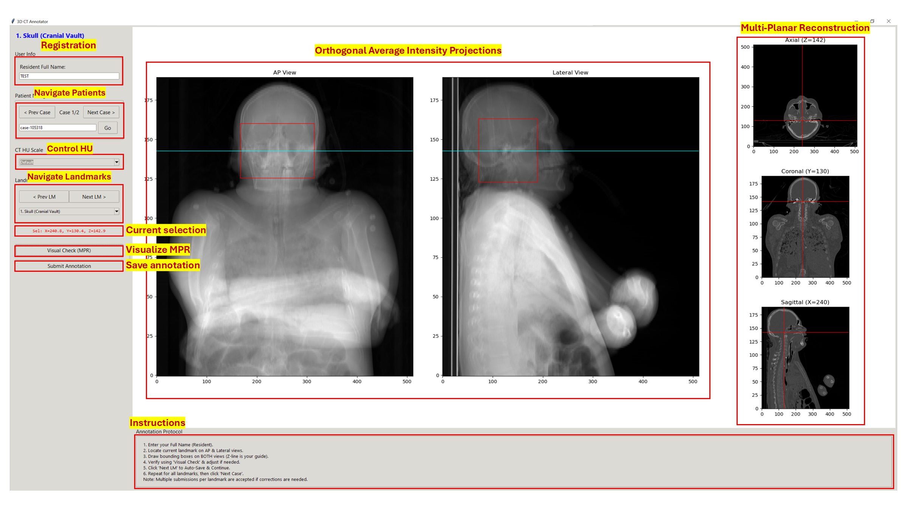

# 3D CT Annotator 🦴

An annotation tool for localizing landmarks on CT scans. The tool provides a synchronized MULTI-VIEW environment. Users draw bounding boxes on AP and Lateral views, which are automatically projected into 3D space and visualized on axial, coronal, and sagittal MPR views.



## Installation

1.  **Clone the repository**:
    ```bash
    git clone <repository-url>
    cd 3D-annotator
    ```

2.  **Install Dependencies**:
    Ensure you have Python installed. Then run:
    ```bash
    pip install -r requirements.txt
    ```
    *(Requires: `numpy`, `matplotlib`, `nibabel`, `tkinter`)*

## Setup Data

The tool expects NIfTI files (`.nii.gz`) in the `data` directory.

1.  Create a `data` folder in the project root if it doesn't exist.
2.  Place your CT scan files inside:
    ```
    3D-annotator/
    ├── data/
    │   ├── case001_ct.nii.gz
    │   └── case002_ct.nii.gz
    ├── src/
    │   └── annotator.py
    ```

## Step-by-Step Guide

1.  **Launch the Application**:
    ```bash
    python src/annotator.py
    ```
    
2.  **Login & Welcome**:
    - A **Welcome Window** will appear first.
    - Read the study instructions and enter your **Full Name**.
    - Click **Start Annotation** to launch the main tool.

3.  **Annotate**:
    - Select a landmark from the dropdown or use the **Next LM** button.
    - **AP/Lateral Views**: Click and drag to draw a bounding box. 
    - **Interactive MPR**: As soon as you draw a box, the MPR views (Bottom Row) will automatically populate with the specific slice centered on your selection.
    - **Refine**: You can adjust the bounding box on **ANY** of the 5 views (AP, Lat, Axial, Coronal, Sagittal). Changes are synchronized instantly across all views.

4.  **Save & Continue**:
    - Click **Next LM** (or **Next Case**) to auto-save your current annotation and move to the next item.
    - Navigating to a new case/landmark resets the views to a clean state.

5. **Optional**: 
    - Use the "CT HU Scale" dropdown to change contrast (e.g., Bone vs Soft Tissue). This updates all views without losing your current selection context.
    - Click the **Help / Instructions** button at the bottom left at any time to review the study protocol.

## Output

Annotations are automatically saved in the `annotations/` directory.

```
3D-annotator/
├── annotations/
│   ├── annotations.csv          <-- Consolidated log of all users
│   ├── <Resident Name>_annotations.csv <-- Individual backup for <Resident Name>
│   └── ...
```

**Format**:
`CaseID, FileName, Resident, LandmarkIdx, LandmarkName, X, Y, Z, AP_Box, Lat_Box`

- **X, Y, Z**: Calculated 3D center of the annotation.
- **AP_Box**: `x_min;x_max;z_min;z_max` (Volume X-axis and Z-axis).
- **Lat_Box**: `y_min;y_max;z_min;z_max` (Volume Y-axis and Z-axis).
     - *Note: Y-axis corresponds to the horizontal axis in the Lateral view.*

---
**Note**: The application uses an "Append-Only" log for safety. If you modify an annotation, a new row is added to the CSV to preserve history.
